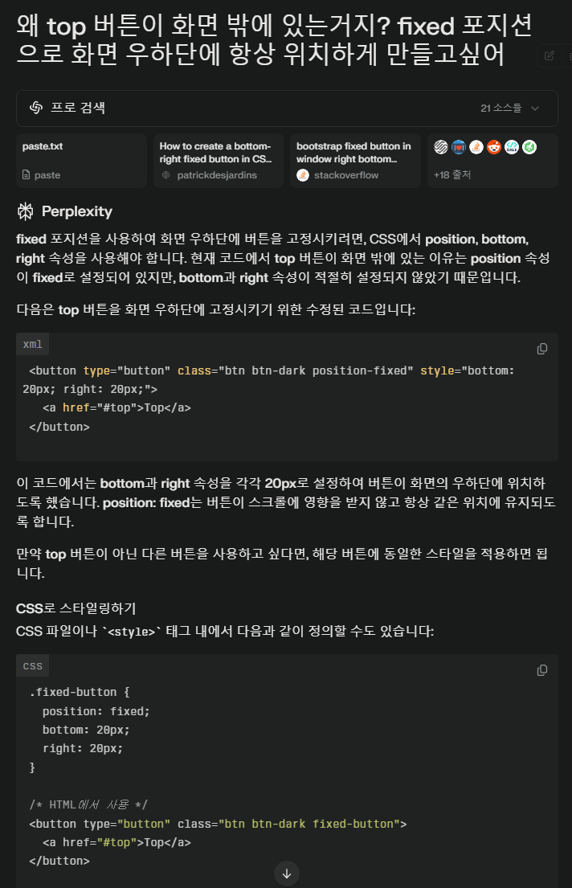
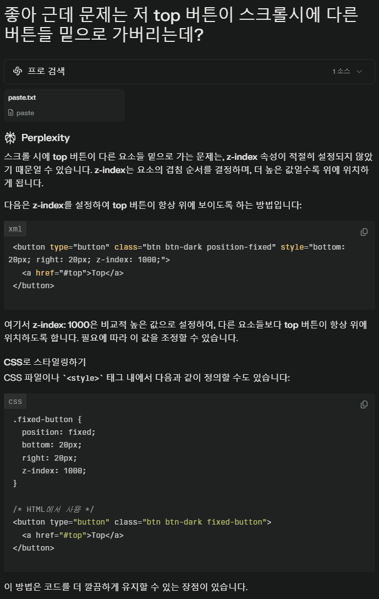

## 어려웠던 부분
- flex설정하는 부분 -> 라이브 강의때도 상당히 간결하게 지나가버렸었는데 행방향 열방향 경우마다 내부 아이템 위치를 잡아주는부분이 여전히 어렵다 
- 하지만 열방향으로 flex를 부여하고 아이템 정렬을 해냈을때 진짜 기뻤다
- 이전에 프로젝트를 진행할때 반응형 웹을 적용시키는 과제를 받았었는데, 혼자 공부해도 미디어쿼리를 쓰라는 정도만 나오고 상세적인 사용 방법을 습득하지 못해 아쉬운 결과물을 낸 경험이 있다
- 이번 3가지 반응형 웹 적용 실습을 통해 완벽하진 못하더라도 내가 원하는 만큼의 요소 배치를 반응형 웹 설정을 통해 만들어냈다
- 실습 내용 외에 클릭시 가장 상단으로 이동하는 "TOP" 버튼을 우하단에 고정 위치시켜 보려는 자율학습을 진행하였는데
- position - fixed 를 줘도 화면 밖으로 나가버리는 경우가 생겨 애를 먹었는데
- style에서 위치를 추가로 지정해주며 에러를 해결하였고
- 다른 버튼과의 레이어 위치(?) 지정 문제도 z-index를 설정해주며 해결하였다

## 새로 배운 것
- hr태그를 알고는 있었는데 이게 그냥 수평선으로만 생각하고 수정해볼 생각은 하지 않았었다
- hr 태그에도 style을 지정하여 두께나 색상을 적용해보았고
- hr 도 border를 제거할 수 있다는 것을 알게되었다
- img도 반응형 웹에 적용되려면 img-fluid를 통해 보다 최적의 반응형 웹 경험을 제공할 수 있다는 것을 알게되었다

## 소감
css는 정말 어렵다
특히 '정답이 없어서' 어렵다는 강사님의 말이 너무 공감이 되었다
코딩은 그래도 그 방향을 향해서 갈 수 있는데
css는 이렇게 해도 되고, 저렇게 해도 되고
그와중에 다른 방식을 쓰면 미봉책에 그치지 않을까 걱정되어 되돌려버리고
또한 내 생각대로 움직여주지도 않는다 
그래도 유일하게 재미있는 부분은
내 눈에 바로 보인다는 것 정도로 생각한다
